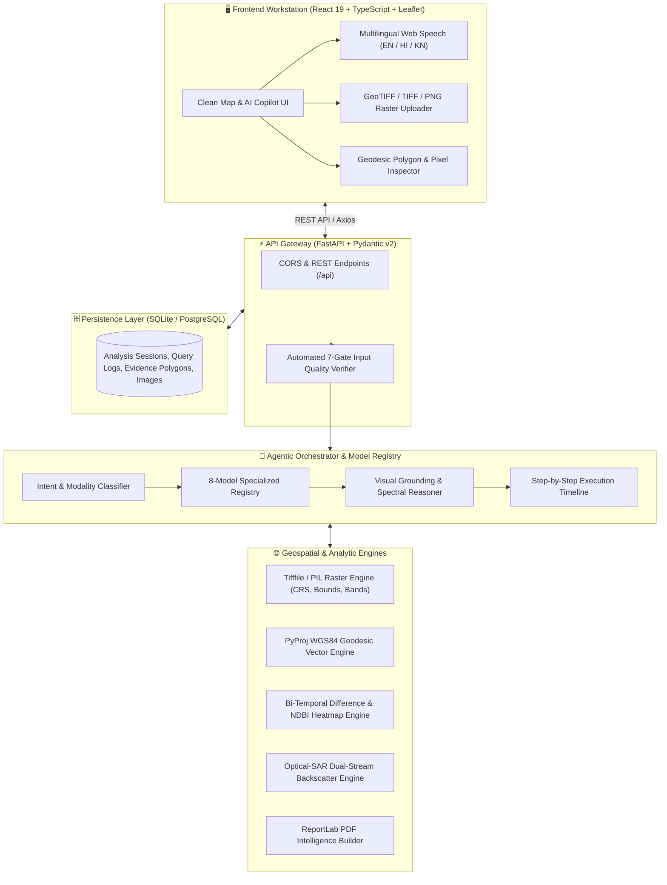

# 🛰️ SatQuery AI — Full-Stack Geospatial Vision-Language Workstation
**Smart India Hackathon (SIH 2026 Edition)**

[](https://opensource.org/licenses/MIT)
[](https://www.python.org/)
[](https://fastapi.tiangolo.com/)
[](https://react.dev/)
[](https://leafletjs.com/)
[]()
[]()

> **An Interactive Vision-Language Assistant for Multimodal Remote Sensing Image Analysis through Natural Language Text and Voice Queries.**

SatQuery AI is an end-to-end, production-grade geospatial intelligence workstation combining multimodal satellite imagery (Optical, Multispectral, and Synthetic Aperture Radar), agentic task orchestration, specialized AI models, interactive Leaflet mapping with real-time geodesic calculations, bi-temporal change detection, multi-turn persistent conversation threads, and publication-grade PDF intelligence reports.

---

## 🧭 System Architecture & Agentic Flow



---

## 🌟 Core Capabilities & Innovations

### 1. 🛰️ Multimodal Satellite Ingestion & Inspection
- **Supported Formats**: Ingests GeoTIFF (`.tif`, `.tiff`), PNG, and JPEG.
- **Automated Metadata Extraction**: Extracts coordinate reference system (CRS `EPSG:4326`/`3857`), ground sampling distance (GSD), raster dimensions, spectral bands, acquisition date, and sensor platform.
- **Sensor Coverage**: Pre-configured support for **Sentinel-2 MSI**, **Sentinel-1 C-SAR (Microwave Radar)**, **Landsat-9 OLI-2**, **Cartosat-3 High-Res**, and **PlanetScope SuperDove**.

### 2. 🛡️ 7-Gate Input Quality Verification (ISRO Compliance)
Before any model execution, rasters are verified against 7 rigorous automated gates:
1. **Format Integrity**: Validates container headers and file byte structures.
2. **Georeferencing**: Ensures tie points or affine transformation matrices exist.
3. **CRS Projection**: Confirms valid projection in standard global or regional ellipsoids.
4. **Cloud Coverage**: Threshold validation prevents clouded imagery from false classifications.
5. **Dynamic Contrast & Dynamic Range**: Verifies radiometric histogram spread (0–100 score).
6. **Resolution & Sampling Consistency**: Asserts spatial ground sampling distance feasibility.
7. **Radiometric Bit-Depth**: Confirms multi-band radiometric fidelity.

### 3. 🎯 Transparent & Auditable Intelligence (No Black Box)
Every analysis provides a complete explainability package:
- **WHAT**: Concrete natural language finding and target breakdown.
- **WHERE**: High-resolution vector polygons and bounding boxes overlaid on the interactive map.
- **WHY TRUST IT**: Radiometric verification, sub-pixel alignment, and multi-band spectral reflectance.
- **HOW**: Tool and specialist AI model identity selected from the model registry.
- **HOW CERTAIN**: Model Confidence Score (%) coupled with an independent Data Reliability Score (*High*, *Medium*, *Low*).
- **EXECUTION TIMELINE**: Millisecond-precision audit trail tracking each step (Query &rarr; Task &rarr; Validation &rarr; Specialist Model &rarr; Spatial Grounding &rarr; Calibrated Localized Answer).

### 4. 🗺️ Interactive Leaflet GIS Workstation
- **Basemaps**: Toggle between high-resolution Esri World Imagery and clean Carto light vector streets.
- **Pixel Inspector**: Click anywhere on the satellite raster to sample multi-band reflectance (Red, Green, Blue, NIR, SWIR-1, SWIR-2), NDVI, NDWI, NDBI, surface temperature, and land cover classification.
- **Real-Time Geodesic Area Calculation**: Interactive polygon drawing tool powered by PyProj WGS84 Geod computing area in **m²**, **km²**, **hectares**, and **acres** along with perimeter.

### 5. 🔄 Bi-Temporal Change Detection & Multi-Sensor Comparison
- **Bi-Temporal Difference Mapping**: Interactive swipe slider comparing historical vs current acquisitions (e.g. 2023 vs 2026) with changed area deltas, concrete sprawl metrics, and change heatmaps.
- **Optical + SAR Dual-Stream Fusion**: Joint analysis combining Sentinel-2 optical bands with Sentinel-1 microwave radar backscatter, explaining cloud penetration, moisture dielectric returns, and sensor consensus %.

### 6. 🗣️ Multilingual & Voice Accessibility
- **Native Languages**: Full support for **English**, **हिन्दी (Hindi)**, and **ಕನ್ನಡ (Kannada)**.
- **Voice Dictation**: Hands-free natural language queries using Web Speech API speech recognition.
- **Voice Playback**: Integrated SpeechSynthesis engine providing native audio playback of AI answers.

### 7. 💾 Multi-Turn Session Persistence & Workspace Resumption
- All user sessions and multi-question conversation threads are persistently recorded in the SQLite database.
- The **History** view allows browsing past analyses, deleting records, or clicking **"Resume in Workspace"** to restore questions, answers, and spatial evidence overlays into the live workstation.

### 8. 📄 Publication-Grade PDF Reporting
- Integrated ReportLab GIS engine that generates formal PDF intelligence reports complete with executive summaries, acquisition metadata, spatial coordinates table, and verified execution audit trails.

---

## 🤖 Specialist AI Model Registry

| Model Name | Version | Primary Task | Supported Modalities | Base Confidence |
| :--- | :--- | :--- | :--- | :--- |
| **SatQuery RS-VLM Specialist** | `v2.1` | General Captioning & VQA | Optical, Multispectral | 94.0% |
| **GeoGrounder-Pro Spatial Segmentor** | `v1.8` | Text-Guided Target Grounding | Optical, Multispectral | 93.5% |
| **Bi-Temporal ChangeNet Engine** | `v2.0` | Multi-Temporal Change Detection | Bi-temporal Optical | 91.2% |
| **LandCover-7 Semantic UNet** | `v3.0` | 7-Class Surface Classification | Multispectral (12-Band) | 92.8% |
| **Optical-SAR Dual Fusion Engine** | `v1.5` | Cross-Sensor Radar Fusion | Optical + C-SAR Radar | 90.5% |
| **FloodInundation RapidNet** | `v2.2` | Emergency Disaster Response | SAR & Optical | 95.8% |
| **AgriCanopy VigorNet** | `v1.9` | NDVI Crop & Moisture Surveillance | Sentinel-2 Red-Edge/NIR | 93.2% |
| **UrbanSprawl GrowthNet** | `v2.4` | Concrete & Arterial Expansion | Bi-temporal Optical | 91.8% |

---

## 🛠️ Technology Stack

| Layer | Technologies |
| :--- | :--- |
| **Frontend UI** | React 19, TypeScript, Vite, Tailwind CSS, Lucide Icons, Recharts, Axios |
| **GIS & Mapping** | Leaflet 1.9, Esri World Imagery, OpenStreetMap, CARTO Light |
| **Internationalization** | i18next, Web Speech API (Dictation), Web Speech Synthesis (Audio Playback) |
| **Backend API** | Python 3.12, FastAPI, Pydantic v2, Uvicorn, SQLAlchemy |
| **Geospatial & Vector Core** | NumPy, Pillow, Tifffile, Shapely, PyProj (WGS84 Geod) |
| **Document Generation** | ReportLab PDF Intelligence Engine |
| **Database** | SQLite (Default, Zero-Config) / PostgreSQL-ready SQLAlchemy Schema |

---

## 🚀 Quick Start Guide

### Prerequisites
- **Node.js**: v18+ and npm
- **Python**: 3.10+ (Python 3.12 recommended)

### Option A: One-Command Full-Stack Launch (Recommended)
We provide a unified runner script that sets up dependencies, checks the database, and launches both FastAPI and Vite dev servers concurrently:

```bash
# Clone the repository
git clone https://github.com/riyaladwa/Satquery-AI.git
cd Satquery-AI

# Run the concurrent launcher
chmod +x dev.sh
./dev.sh
```

Once running:
- **Frontend Workstation**: [http://localhost:5173](http://localhost:5173)
- **FastAPI Interactive Docs (Swagger)**: [http://127.0.0.1:8000/docs](http://127.0.0.1:8000/docs)
- **API Health Check**: [http://127.0.0.1:8000/api/health](http://127.0.0.1:8000/api/health)

---

### Option B: Manual Step-by-Step Setup

#### 1. Backend Setup
```bash
# From repository root:
source backend/venv/bin/activate || python3 -m venv backend/venv && source backend/venv/bin/activate
pip install -r backend/requirements.txt

# Run automated tests
PYTHONPATH=backend backend/venv/bin/pytest backend/tests/

# Start FastAPI server
PYTHONPATH=backend python3 backend/app/main.py
```

#### 2. Frontend Setup
```bash
# In a separate terminal tab:
cd frontend
npm install
npm run dev
```

---

## 📡 REST API Reference

| Endpoint | Method | Description |
| :--- | :--- | :--- |
| `/api/health` | `GET` | Health check, platform version, and engine status |
| `/api/images` | `GET` | List all available satellite scenes and raster metadata |
| `/api/images/{id}` | `GET` | Retrieve metadata, bounds, CRS, and preview for a scene |
| `/api/images/upload` | `POST` | Upload GeoTIFF/PNG/JPEG, georeference, and generate preview |
| `/api/images/{id}/validate` | `GET` | Run automated 7-gate ISRO-compliant input quality checks |
| `/api/analyze` | `POST` | Execute agentic vision-language query with spatial evidence |
| `/api/pixel/inspect` | `GET` | Sample multi-band reflectance, NDVI, and surface classification |
| `/api/area/calculate` | `POST` | Calculate WGS84 geodesic polygon area (m², km², ha, acres) |
| `/api/compare/bitemporal` | `GET` | Compute change metrics and spatial polygons between two scenes |
| `/api/compare/optical-sar` | `GET` | Joint Optical + SAR radar cross-sensor fusion analysis |
| `/api/history/sessions` | `GET` | Retrieve list of recorded multi-turn analysis sessions |
| `/api/history/sessions/{id}` | `GET` | Get full conversation thread and evidence for a session |
| `/api/history/sessions/{id}` | `DELETE` | Delete an analysis session from the database |
| `/api/reports/generate` | `POST` | Compile formal PDF intelligence report with ReportLab |
| `/api/reports/{id}/download` | `GET` | Download generated PDF intelligence report |
| `/api/models` | `GET` | Inspect active models in the registry |

---

## 🧪 Automated Testing

SatQuery AI includes unit, integration, and compliance test suites:

```bash
# Run all backend tests
PYTHONPATH=backend backend/venv/bin/pytest backend/tests/ -v

# Run frontend typecheck and build validation
cd frontend && npm run build
```

---

## 👥 Contributors & Acknowledgements
- **Team**: SatQuery AI Development Team
- **Event**: Smart India Hackathon (SIH 2026 Edition)
- **Data Providers**: European Space Agency (Copernicus Sentinel-1 & Sentinel-2), ISRO Bhuvan Open Data Architecture.
- **License**: MIT License. Open-source and freely available for research and operational use.
